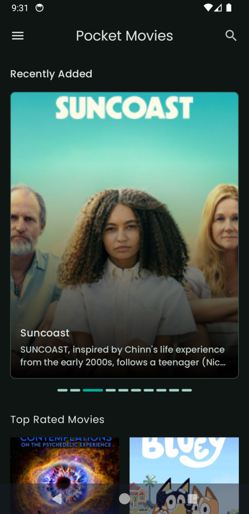
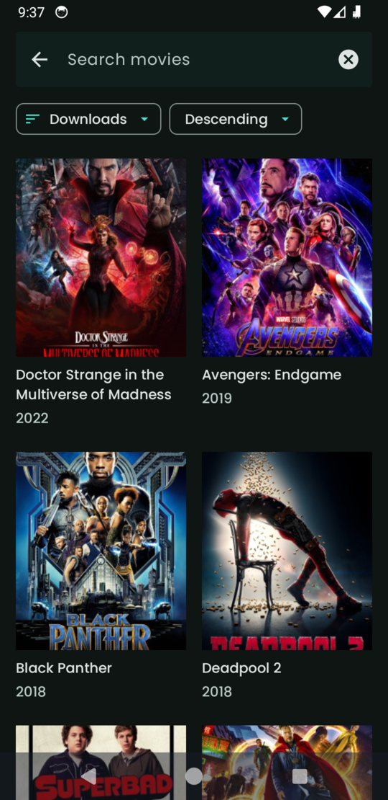
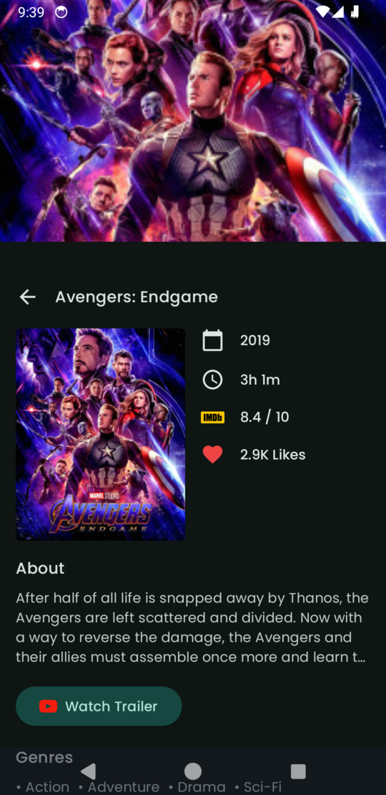

# PocketMovies

Explore movies from YTS api.

## Download

[View Apk File](/app/release/)

## Android development

- Entirely written in [Kotlin](https://kotlinlang.org/).
- UI completely written in [Jetpack Compose](https://developer.android.com/jetpack/compose) (see below).
- Uses [Kotlin Coroutines](https://kotlinlang.org/docs/reference/coroutines/coroutines-guide.html) throughout.
- Uses many of the [Architecture Components](https://developer.android.com/topic/libraries/architecture/), including: Lifecycle, Navigation.
- Uses [Hilt](https://dagger.dev/hilt/) for dependency injection

## Jetpack Compose

PocketMovies' UI is completely written in [Jetpack Compose](https://developer.android.com/jetpack/compose). Some screenshots:

### Home Page

[[source](/app/src/main/java/org/dreamerslab/pocketmovies/ui/home/HomeScreen.kt)]

### Search

[[source](/app/src/main/java/org/dreamerslab/pocketmovies/ui/search/SearchScreen.kt)]

### Movie Details

[[source](/app/src/main/java/org/dreamerslab/pocketmovies/ui/moviedetails/MovieDetails.kt)]

